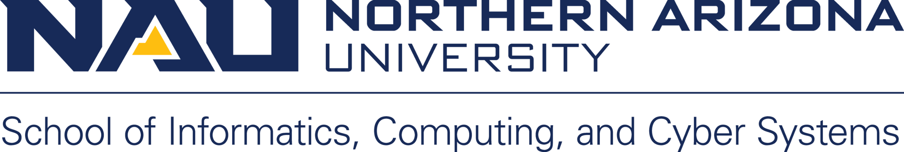

\

\

***Environmental Informatics using Research Infrastructures and their Data***

# Instructor Guide

*Katharyn Duffy*

*Ben Ruddell*

*Rohan Boone*

------------------------------------------------------------------------

LI = Lead Instructor

PI = Programming Instructor

TA = Teaching Assistant

See the suggested syllabus and digital textbook fro references to lecture, unit, and assignment content.

Course meetings are designed based on a 3 credit-hour, semester-long course (i.e. 15 weeks with 2, 1.5 hour meetings per week). Instructors may find it necessary to dedicate class meetings to additional coding help/demonstrations. To account for this, we present 25 days worth of course material (out of 30 total days of class meetings) to provide additional time to tailor the class to specific needs. The organization of the course may be altered to reflect varying schedules.

It is recommended that student questions be directed to a course chat-room (e.g. Gitter, Slack) or mailing list to reduce instructor workload by allowing students to answer each other's questions, particularly if there is no PI or TA.

## Day 1, Chapter 0-1

-   LI covers introduction to Ecoinformatics and the purpose of the course ([Pre-Course Setup: Ecoinformatics Tools](https://nau-ecoinfo.github.io/INF550-textbook/pre-course-setup-ecoinformatics-tools.html#pre-course-skills-setup)), syllabus (if applicable), and course expectations ([0.6 How we will be Conducting this Course](https://nau-ecoinfo.github.io/INF550-textbook/pre-course-setup-ecoinformatics-tools.html#how-we-will-be-conducting-this-course)) (\~15 minutes).

-   LI directs students to post questions about course content to a course chat-room or mailing list (if applicable, \~ 3 minutes).

-   PI or LI covers resources to catch up if some of the required skill are rusty or missing and git assignment ([0.7.1: A git introduction](https://nau-ecoinfo.github.io/INF550-textbook/pre-course-setup-ecoinformatics-tools.html#exercises)) (\~ 10 minutes).

-   LI covers [Chapter 1: Why 'Ecoinformatics'?](https://nau-ecoinfo.github.io/INF550-textbook/why-ecoinformatics.html) (\~ 30 minutes).

-   Overview of course framework ([1.1 The Framework of this Course](https://nau-ecoinfo.github.io/INF550-textbook/why-ecoinformatics.html#the-framework-of-this-course)) and final project ([1.2 Final Course Project: Proposed Derived Data Product](https://nau-ecoinfo.github.io/INF550-textbook/why-ecoinformatics.html#final-course-project-proposed-derived-data-product)) (\~ 15-20 minutes).

-   One or two example assignemnts that exemplify what is expected (if applicable, \~ 5 minutes).

## Day 2, Chapter 2

-   PI or LI leads a check-in on last lecture's git assignment ([Exercise 0.1: A Git Introduction](https://nau-ecoinfo.github.io/INF550-textbook/pre-course-setup-ecoinformatics-tools.html#exercises), \~ 3-5 minutes).

-   Sections [2.2](https://nau-ecoinfo.github.io/INF550-textbook/introduction-to-neon-its-data.html#the-neon-project-mission-design)-[2.5](https://nau-ecoinfo.github.io/INF550-textbook/introduction-to-neon-its-data.html#how-neon-collects-data); LI (and guest speaker, if available) introduces NEON , its mission, its design (\~ 10-20 minutes).

-   **Guest Lecture**: [Donal O'Leary - Introduction to the National Ecological Observatory Network (NEON)](https://nau-ecoinfo.github.io/INF550-textbook/introduction-to-neon-its-data.html#introduction-to-the-national-ecological-observatory-netowrk-neon)

    -   Donal O'Leary, Research Scientist, Education and Outreach, NEON - Battelle, outlines NEON's Ten Big Ideas, talks about program funding and the Battelle takeover, and explains NEON data availability, site selection, and constraints.

-   LI or PI briefly goes over NEON API tokens ([2.7 Hands on: Accessing NEON Data & User Tokens](https://nau-ecoinfo.github.io/INF550-textbook/introduction-to-neon-its-data.html#hands-on-accessing-neon-data-user-tokens))

    -   Students will need a Token for the hands on coding exercise in the next class. Instruct them to obtain one by following the directions in section 2.7.1-2.7.4 of the textbook. Students do not need to complete [2.7.3 Use the NEON token in neonUtilities](https://nau-ecoinfo.github.io/INF550-textbook/introduction-to-neon-its-data.html#things-youll-need-to-complete-this-tutorial).

    -   Assign the firt part of [2.10.1 NEON Coding Lab - TOS Vegetation Structure](https://nau-ecoinfo.github.io/INF550-textbook/introduction-to-neon-its-data.html#exercise-2.1-neon-coding-lab---tos-vegetation-structure), in which students obtain a NEON API token.

-   If time permits: go over the first assignment as a class.

## Day 3, Chapter 2

-   PI introduces 'best practices' for taking live coding notes and git ignore (\~ 10 minutes).
    -   The recorded lecture below and many that follow include a coding demonstration ([2.8 Hands On: NEON TOS Data](https://nau-ecoinfo.github.io/INF550-textbook/introduction-to-neon-its-data.html#hands-on-neon-tos-data)). Students should be advised to code along with Donal in the recorded lecture. Remind students to download `R` packages necessary for the exercise (see first few code chunks in 2.8)
-   **Guest Lecture**: [Donal O'Leary - Interfacing with NEON and its Data](https://nau-ecoinfo.github.io/INF550-textbook/introduction-to-neon-its-data.html#interfacing-with-neon-and-its-data)
    -   Donal O'Leary, Research Scientist, Education and Outreach, NEON - Battelle, demonstrates best practices for accessing NEON data using NEON's online platform and RStudio.
    -   The video is \~ 1 hour, but may be paused to give students time to code along.
-   PI or LI walks through [NEON Coding Lab - TOS Vegetation Structure](https://nau-ecoinfo.github.io/INF550-textbook/introduction-to-neon-its-data.html#neon-coding-lab---tos-vegetation-structure) with the class (remaining time).
    -   This exercise consists of two parts: first students submit an .Rmd and .pdf of a scupt that proves that they have a NEON API token, then they will complete a coding lab using NEON TOS data.

## Day 4, Chapter 2

-   LI checks in with students, cirlces up on expectations (\~ 5 minutes).

-   PI or LI reviews [NEON Coding Lab - TOS Vegetation Structure](https://nau-ecoinfo.github.io/INF550-textbook/introduction-to-neon-its-data.html#neon-coding-lab---tos-vegetation-structure).

-   PI or LI: [2.11 What is an API](https://nau-ecoinfo.github.io/INF550-textbook/introduction-to-neon-its-data.html#what-is-an-api)

-   Discussion Topics:

    -   Why are APIs important?

    -   What was life like before APIs?

    -   When should you use an API versus pulling the data locally? Why would each strategy be important?

    -   What is a JSON and why would NEON use it to wrap data from their API?

    -   The commonality of API pulls despite the data retrieved

-   PI lectures through stacking NEON data

-   Remaining time: go over [NEON Written Questions](https://nau-ecoinfo.github.io/INF550-textbook/introduction-to-neon-its-data.html#neon-written-questions) and [NEON Coding Lab - Further Exploration of NEON Data](https://nau-ecoinfo.github.io/INF550-textbook/introduction-to-neon-its-data.html#neon-coding-lab---further-exploration-of-neon-data)

## Day 5, Chapter 2

-   PI: History of 'levels' of observations in NEON

    -   What made the cut, what didn't, and why?

-   Class discussion:

    -   What NEON data products interest you? Why?

    -   What data do you think is 'missing' from NEON? What other data could you bring in?

    -   If time permits, ask each student to give their #1 product and #1 missing product.

        -   Ask students to consider combining those two into a new derived data product.

-   LI: [NEON Culmination Activity](https://nau-ecoinfo.github.io/INF550-textbook/introduction-to-neon-its-data.html#intro-to-neon-culmination-activity) goals and expectations

## Day 6, Chapter 3

-   LI: Introduction to USA-NPN and the power of citizen science (\~ 5 minutes).

    -   Even if some not interested in phenology, we are covering this network and this type of data because it has unique challenges and opportunities. This type of citizen science data extends to other disciplines.

-   **Guest Lecture**: [Theresa Crimmins - Introduction to the USA National Phenology Network](https://nau-ecoinfo.github.io/INF550-textbook/introduction-to-usa-npn-its-data.html#introduction-to-the-usa-national-phenology-network)

    -   Theresa Crimmins, USA-NPN director, introduces the USA National Phenology Network, describes the platform's citizen science approach to gathering data, and explains how to access USA-NPN data (1 hour, 6 minutes).

-   LI or PI: Q&A about USA-NPN (remaining time)

## Day 7, Chapter 3

-   PI (or LI): How observation networks are building tools to imrove access to data (\~ 5 minutes)

-   **Guest Lecture**: [Lee Marsh - Working with USA-NPN Data](https://nau-ecoinfo.github.io/INF550-textbook/introduction-to-usa-npn-its-data.html#working-with-usa-npn-data)

    -   Lee Marsh, USA-NPN IT Coordinator, describes how USA-NPN pulls in citizen science observations, outlines the `rnpn` package, and provides an hands-on example (\~ 1 hour, 5 minutes).

-   PI: Review homework schedule (remaining time)

## Day 8, Chapter 3

-   **Guest Lecture**: [Luke Zachmann - Challenges with Observational Science Data](https://nau-ecoinfo.github.io/INF550-textbook/introduction-to-usa-npn-its-data.html#challenges-with-observational-and-citizen-science-data)

    -   Luke Zachmann, Senior Scientist, Conservation Science Partners, explains data censorship, interval data, and data truncation, and shares pro tips and useful techniques when dealing wit citizen science data (43 minutes).

    -   Note: The recording currently embedded in the texbook (and linked above) is an un-edited version. We're currently working on getting an edited version uploaded and embedded.

-   LI: Review Final Project Guidelines (\~ 5-10 minutes)

-   LI: Review USA-NPN culmination writeup (\~ 5-10 minutes)

## Day 9, Chapter 4

-   LI: Introduce Digital Repeat Photography, its utility, various networks (\~ 5 minutes).

-   **Guest Lecture**: Andrew Richardson - PhenoCam: Marrying phenology and fluxes

    -   ***This video is currently missing.*** In lieu of a pre-recorded lecture, the LI can review section [4.2](https://nau-ecoinfo.github.io/INF550-textbook/phenocam-digital-repeat-photography-networks-methods.html#the-phenocam-network-mission-design) - [4.3](https://nau-ecoinfo.github.io/INF550-textbook/phenocam-digital-repeat-photography-networks-methods.html#phenocams-spatial-design).

-   LI or PI: Q&A regarding PhenoCam (\~ 10 minutes)

-   Assign [Digital Repeat Photography Written Questions](https://nau-ecoinfo.github.io/INF550-textbook/phenocam-digital-repeat-photography-networks-methods.html#digital-repeat-photography-written-questions).

## Day 10, Chapter 4

-   **Guest Lecture**: [Bijan Seyednasrollah - Digital Repeat Photography Methods](https://nau-ecoinfo.github.io/INF550-textbook/phenocam-digital-repeat-photography-networks-methods.html#digital-repeat-photography-methods)

    -   Bijan Seyednasrollah, Post-doctoral scholar at Northern Arizona University, School of Informatics, Computing, and Cyber Systems, and lead developer of phenocamapi, covers digital repeat photography methods and the phenocamapi R package (1 hour, 11 minutes).

-   LI or PI: Q&A regarding digital repeat photography methods (remaining time).

## Day 11, Chatper 4

-   PI: Check in on outstanding assignments (\~ 3 minutes).

-   Hands on coding with `xROI` and `phenocamapi`

-   [Hands on: Digital Repeat Photography Computational](https://nau-ecoinfo.github.io/INF550-textbook/phenocam-digital-repeat-photography-networks-methods.html#hands-on-digital-repeat-photography-computational)

-   Assign [Digital Repeat Photography Coding Lab](https://nau-ecoinfo.github.io/INF550-textbook/phenocam-digital-repeat-photography-networks-methods.html#digital-repeat-photography-coding-lab)

-   Assign [Digital Repeat Photography Culmination Activity](https://nau-ecoinfo.github.io/INF550-textbook/phenocam-digital-repeat-photography-networks-methods.html#phenocam-culmination-activity)

## Day 12, Chapter 5

-   LI: Introduce NEON Flux Data and interoperability (Section [5.2](https://nau-ecoinfo.github.io/INF550-textbook/flux-measurements-inter-operability.html#eddy-co_variance-data-what-does-it-actually-measure) - [5.5](https://nau-ecoinfo.github.io/INF550-textbook/flux-measurements-inter-operability.html#the-power-of-networked-ecology-bridging-to-ameriflux-and-beyond)).

-   **Guest Lecture**: [Chris Florian - NEON Flux Data and Interoperability, Part 1](https://nau-ecoinfo.github.io/INF550-textbook/flux-measurements-inter-operability.html#neon-flux-data-and-inter-operability-part-1)

    -   Chris Florian, Research Scientist, Surface-Atmosphere Exchange, NEON-Battelle introduces NEON flux data and explains flux towers, Eddy Covariance, NEON-AmeriFlux collaborations, and future directions for the project (58 minutes).

-   LI or PI: Q&A Regarding NEON Flux and Interoperability (remaining time).

## Day 13, Chapter 5

-   **Guest Lecture**: [Chris Florian - NEON Flux Data and Interoperability, Part 2](https://nau-ecoinfo.github.io/INF550-textbook/flux-measurements-inter-operability.html#neon-flux-data-and-inter-operability-part-2)

    -   Chris Florian, Research Scientist, Surface-Atmosphere Exchange, NEON-Battelle provides an in-depth demonstration of how to access and work with NEON Flux data (1 hour, 10 minutes).

-   LI or PI: Q&A regarding NEON flux data and interoperability (remaining time)

-   Assign [NEON Flux Coding Lab](https://nau-ecoinfo.github.io/INF550-textbook/flux-measurements-inter-operability.html#neon-flux-coding-lab).

## Day 14, Chapter 5

## Day 15, Chapter 6

-   LI: Introduce NEON Airborne Observation Platform (Section [6.1](https://nau-ecoinfo.github.io/INF550-textbook/neon-aop.html#learning-objectives-4) - [6.2](https://nau-ecoinfo.github.io/INF550-textbook/neon-aop.html#about-hyperspectral-remote-sensing))

-   **Guest Lecture**: [John Musinsky - Introduction to NEON Airborne Observation Platform](https://nau-ecoinfo.github.io/INF550-textbook/neon-aop.html#introduction-to-neon-airborne-observation-platform)

    -   John Musinsky, Researd Scientist, Remote Sensing, NEON-Battelle, introduces the NEON Airborne Observation Platform, and describes the various data products and quality control metrics offered by the platform (1 hour, 10 minutes).

-   Assign [NEON AOP Written Questions](https://nau-ecoinfo.github.io/INF550-textbook/neon-aop.html#neon-aop-written-questions) (\~ 3-5 minutes).

    -   This assignment covers many topics introduced throughout this chapter. Students should be aware of the assignment, and answering the written questions as certain topics come up over the course of the next few meetings. This assignment should be started immediately, and turned in along side the coding lab and culmination activity.

-   LI or PI: Q&A Regarding NEON AOP (remaining time).

## Day 16, Chapter 6

-   LI: Introduce Hyperspectral Remote Sensing (Section [6.2](https://nau-ecoinfo.github.io/INF550-textbook/neon-aop.html#about-hyperspectral-remote-sensing) - [6.3](https://nau-ecoinfo.github.io/INF550-textbook/neon-aop.html#key-metadata-for-hyperspectral-data), 10-15 minutes).

-   **Guest Lecture** [Tristan Goulden - NEON AOP: Introduction to Hyperspectral Data](https://nau-ecoinfo.github.io/INF550-textbook/neon-aop.html#neon-aop-introcudtion-to-hyperspectral-data)

    -   Dr. Tristan Goulden, Lead Research Scientist, Remote Sensing, NEON-Battelle, introduces hyperspectral data, and talks about spectral and spatial resolution, spectrometer calibration and collection, data products, and challenges with the platform (1 hour, 2 minutes).

-   LI or PI: Q&A regarding NEON AOP Hyperspectral Data (remaining time).

## Day 17, Chapter 6

-   LI: Introduce Light and Detection Ranging Data (Section [6.8](https://nau-ecoinfo.github.io/INF550-textbook/neon-aop.html#light-detection-and-ranging-lidar-data) - [6.9](https://nau-ecoinfo.github.io/INF550-textbook/neon-aop.html#calculating-forest-structural-diversity-metrics-from-neon-lidar-data), \~ 10-15 minutes).

-   **Guest Lecture**: [Tristan Goulden - NEON AOP: Introduction to LiDAR Data](https://nau-ecoinfo.github.io/INF550-textbook/neon-aop.html#neon-aop-introduction-to-lidar-data)

    -   Dr. Tristan Goulden, Lead Research Scientist, Remote Sensing, NEON-Battelle, introduces LiDAR data, including data processing, quality assurance, vertical and horizontal accuracy, and data validation and uncertainty (57 minutes).

-   NOTE: The `rGEDI` package used in demonstrations in this section may be broken and un-installable at the time this course is being offered.

-   LI or PI: Q&A reguarding LiDAR Data (remaining time).

## Day 18, Chapter 6

-   LI: Introduce NEON LiDAR GEDI fusion (section [6.13](https://nau-ecoinfo.github.io/INF550-textbook/neon-aop.html#matching-gedi-waveforms-with-neon-aop-lidar-pointclouds))

-   **Guest Lecture**: [NEON GEDI LiDAR Fusion](https://nau-ecoinfo.github.io/INF550-textbook/neon-aop.html#neon-lidar-gedi-fusion)

    -   Dr. Donal O'Leary, Reserach Scientist, Education and Outreach, NEON-Battelle, covers NEON LiDAR GEDI Fusion (1 hour, 11 minutes).

-   Assign [NEON AOP Coding Lab](https://nau-ecoinfo.github.io/INF550-textbook/neon-aop.html#neon-aop-coding-lab) and [NEON AOP Culmination Activity](https://nau-ecoinfo.github.io/INF550-textbook/neon-aop.html#neon-aop-culmination-activity) (\~ 3-5 minutes).

-   LI or PI: Q&A regarding NEON LiDAR GEDI fusion (remaining time).

## Day 19, Chapter 7

-   LI: Introduce NASA EOS, Project Mission and design (section [7.1](https://nau-ecoinfo.github.io/INF550-textbook/nasas-earth-observing-system-eos.html#learning-objectives-8) - [7.2](https://nau-ecoinfo.github.io/INF550-textbook/nasas-earth-observing-system-eos.html#nasa-eos-project-mission-design)) (\~ 10-15 minutes).

-   LI or PI: Have students create a NASA EOS Earth Data account (section [7.3](https://nau-ecoinfo.github.io/INF550-textbook/nasas-earth-observing-system-eos.html#nasa-eos-earth-data-account)).

    -   This is a necessary step for any coding assignments and hands on demonstrations involving NASA EOS, so this should be done ASAP.

-   **Guest Lecture**: [NASA EOS Data and Information System: the Role of DAACs](https://nau-ecoinfo.github.io/INF550-textbook/nasas-earth-observing-system-eos.html#nasa-eos-data-and-information-system-the-role-of-daacs)

    -   Dr. Tom Maiersperger, Project Scientist, LP DAAC, describes the structure and goals of NASA EOS, and outlines the platform's operations, users, products, outreach, and current and future missions (1 hour, 8 minutes).

-   Assign [NASA EOS Coding Assignment](https://nau-ecoinfo.github.io/INF550-textbook/nasas-earth-observing-system-eos.html#nasa-eos-coding-assignment) (remaining time).

## Day 20, Chapter 7

LI: Introduce LP DAAC/AppEEars (section [7.6](https://nau-ecoinfo.github.io/INF550-textbook/nasas-earth-observing-system-eos.html#the-lpdaac-mission-process-archive-distribute-apply)-[7.7](https://nau-ecoinfo.github.io/INF550-textbook/nasas-earth-observing-system-eos.html#appeears), \~ 10-15 minutes).

-   **Guest Lecture**: [Accessing Data from the LP DAAC](https://nau-ecoinfo.github.io/INF550-textbook/nasas-earth-observing-system-eos.html#accesssing-data-from-the-lp-daac)

    -   Aaron Friez, Science Coordination Lead, LP DAAC, introduces the AppEEars application and explains how to access data products from the AppEEars database (1 hour, 5 minutes).

-   Assign [NASA EOS Coding Lab](https://nau-ecoinfo.github.io/INF550-textbook/nasas-earth-observing-system-eos.html#nasa-eos-coding-lab---ndvi-in-appeears) and [NASA EOS Culmination Activity](https://nau-ecoinfo.github.io/INF550-textbook/nasas-earth-observing-system-eos.html#nasa-eos-culmination-activity) (\~ 3 minutes).

-   LI or PI: Q&A regarding accessing data from the LP DAAC (remaining time).

## Day 21, Chapter 8

-   LI: Introduce USGS National Weather Information System (sections [8.1](https://nau-ecoinfo.github.io/INF550-textbook/usgs-national-water-information-system-nwis.html#learning-objectives-9)-[8.3](https://nau-ecoinfo.github.io/INF550-textbook/usgs-national-water-information-system-nwis.html#usgs-water-resources-mission))

-   **Guest Lecture**: [USGS Water Resources Data: The Internet of Water](https://nau-ecoinfo.github.io/INF550-textbook/usgs-national-water-information-system-nwis.html#usgs-water-resources-data-the-internet-of-water)

    -   Jim Kreft, Product owner, USGS Water Resources Mission, introduces the USGS Water Resources dashboard, explains how to query location-specific information, and provides a roadmap for new data products (54 minutes).

-   Assign [USGS Coding Lab](https://nau-ecoinfo.github.io/INF550-textbook/usgs-national-water-information-system-nwis.html#usgs-coding-lab) (\~ 3 minutes).

-   LI or PI: Q&A regarding USGS NWIS (remaining time).

## Day 22, Chapter 8

LI: Introduce USGS NWIS Data (sections [8.6](https://nau-ecoinfo.github.io/INF550-textbook/usgs-national-water-information-system-nwis.html#introduction-to-usgs-r-packages)-[8.7](https://nau-ecoinfo.github.io/INF550-textbook/usgs-national-water-information-system-nwis.html#data-available) (\~ 10 minutes)).

-   **Guest Lecture**: [Accessing Data from the USGS National Water Information System](https://nau-ecoinfo.github.io/INF550-textbook/usgs-national-water-information-system-nwis.html#accessing-data-from-the-usgs-national-water-information-system)

    -   Dr. Laura DeChico, Data Manager and R Package Developer, U.S. Geological Survey's Data Science Branch of the Water Resources Mission Area, introduces the USGS Water Resources GitHub, and provides in-depth examples of how to access the data in R (1 hour, 10 minutes).

-   LI or PI: Q&A regarding accessing data from USGS NWIS (remaining time).

## Day 23, Chapter 8

LI: Introduce geoKnife (section [8.17](https://nau-ecoinfo.github.io/INF550-textbook/usgs-national-water-information-system-nwis.html#geoknife---introduction)-[8.20](https://nau-ecoinfo.github.io/INF550-textbook/usgs-national-water-information-system-nwis.html#lesson-resources-1) (\~ 10 minutes)).

**Guest Lecture**: [USGS National Water Information System: Using the geoKnife Package](https://nau-ecoinfo.github.io/INF550-textbook/usgs-national-water-information-system-nwis.html#usgs-national-water-information-system-using-the-geoknife-package)

-   Dr. Jordan Reed, Chief, U.S. Geological Survey's Data Science Branch of the Water Resources Mission Area, introduces the geoknife package, its interface, and how to use it t oconnect data and resources, including examples in R (52 minutes).

-   Assign [USGS Culmination Activity](https://nau-ecoinfo.github.io/INF550-textbook/usgs-national-water-information-system-nwis.html#usgs-nwis-culmination-activity) (\~ 3 minutes).

- LI or PI: go over final project expectaions, solicit volunteers for a 'dry run' (\~ 10-15 minutes).

-   LI or PI: Q&A regarding the geoKnife Package (remaining time).

## Day 24, final project

- Dry run IGNITE talks (whole class).

  - This gives students a chance to see IGNITE talks, and receive feedback without being graded. If you don't have time for this in you course offering, feel free to skip it. 
  
## Day 25, final project

- Final IGNITE Presentations

  - Depending on the size of your class, it may take more than one day to complete all student talks. There is time built into the course plan outlined here for additional days of presentations.
  
  
